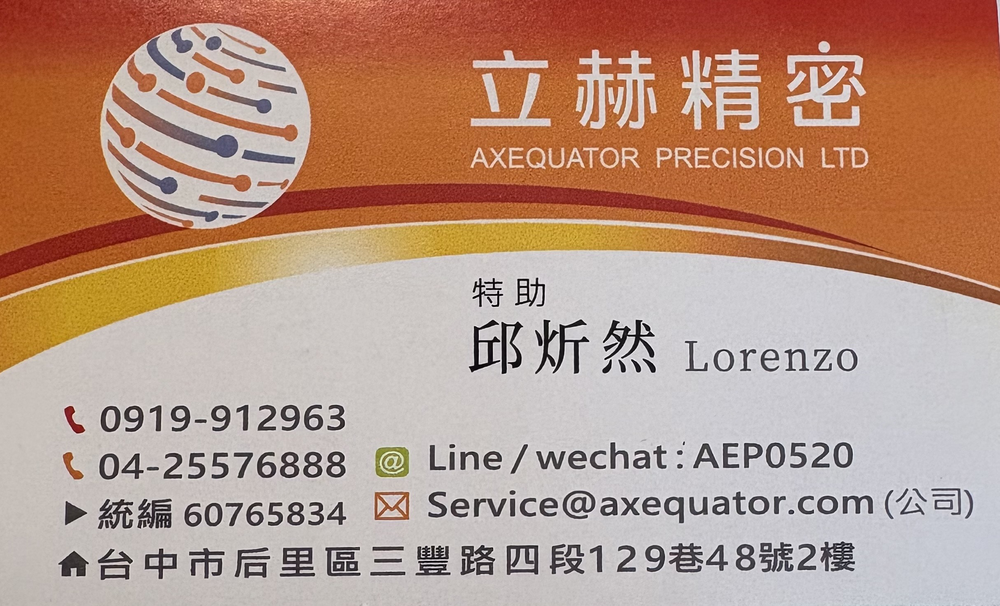
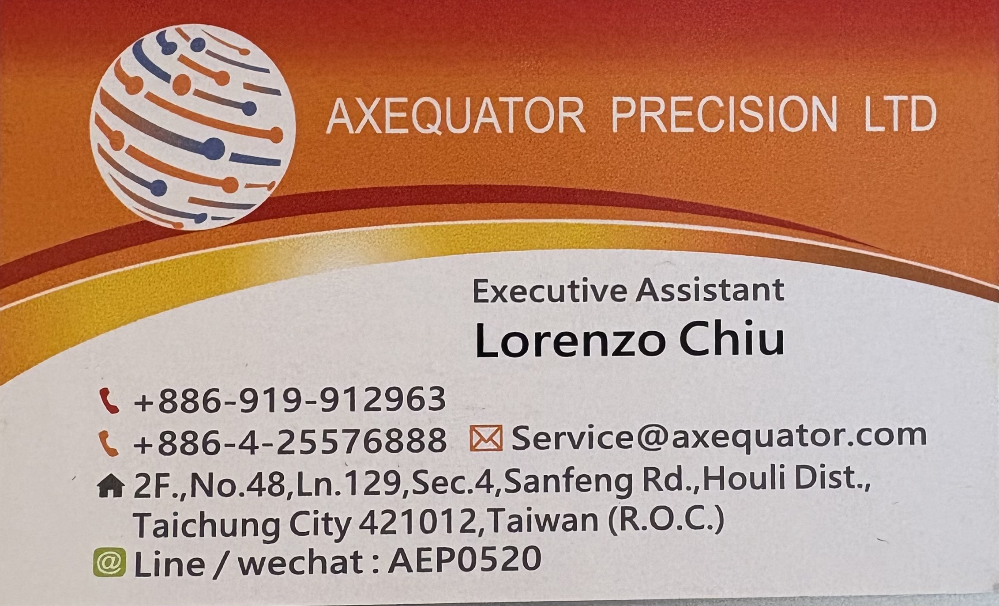

# 立赫精密｜AXEQUATOR PRECISION LTD

🌐 **官方展示網站**：[立赫精密｜AXEQUATOR PRECISION LTD](https://citriclin0422.github.io/company-product/)

---

## 🏢 關於立赫精密 (About Axequator)

立赫精密 (AXEQUATOR PRECISION LTD) 專注於半導體設備維護與現場工程作業，秉持「安全優先、作業確實、溝通清楚、按規範執行」的理念，提供半導體廠區高標準的專業技術支援服務。

### ⚙️ 核心業務 (Core Services)
1. **半導體設備維修**：設備異常檢查與維修支援、預防保養及定期檢查、狀態記錄確認。
2. **零組件檢查與更換**：耗材狀況確認、拆裝與復原支援、料號與安裝位置雙重核對。
3. **鋼瓶更換作業支援**：作業前許可確認、遵循客戶標準作業程序 (SOP) 執行更換與現場配合作業。

---

## 📇 公司名片資訊 (Business Cards)

### 📌 中文名片 (Chinese Business Card)

### 📌 英文名片 (English Business Card)

---

## 📞 聯絡資訊 (Contact Information)

- **公司名稱**：立赫精密有限公司 (AXEQUATOR PRECISION LTD)
- **統一編號**：`60765834`
- **聯絡窗口**：邱炘然 Lorenzo Chiu（特助 / Executive Assistant）
- **行動電話**：[0919-912963](tel:0919912963) / +886-919-912963
- **公司電話**：[04-25576888](tel:0425576888) / +886-4-25576888
- **Line / WeChat ID**：`AEP0520`
- **電子郵件**：[Service@axequator.com](mailto:Service@axequator.com)
- **公司地址**：台中市后里區三豐路四段129巷48號2樓 (2F., No.48, Ln. 129, Sec. 4, Sanfeng Rd., Houli Dist., Taichung City 421012, Taiwan)
- **營業時間**：週一至週五 08:30 - 17:30

---

## 🚀 網站建置說明

- **技術架構**：語意化 HTML5、現代化 Vanilla CSS3 (Design Tokens & 響應式佈局)、原生 JavaScript
- **相容性**：支援 360px 手機、平板、桌機與 4K 解析度
- **部署平台**：GitHub Pages ([https://citriclin0422.github.io/company-product/](https://citriclin0422.github.io/company-product/))

---
© 2026 AXEQUATOR PRECISION LTD (立赫精密有限公司). All rights reserved.
